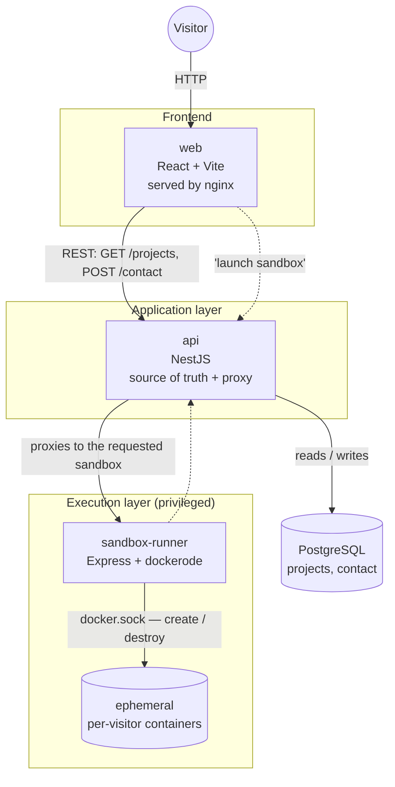

# Portfolio

Personal portfolio, built as a monorepo, designed to not be a classic static site: every project shown can be **launched and tried live** by the visitor, inside an isolated environment (Docker sandbox), on top of a regular presentation (description, stack, repo/demo links).

## Concept

The site is made of three independent services:

- **`web`** — the frontend (React + Vite): project list and detail pages, contact form, and the UI to launch/watch a sandbox.
- **`api`** — the backend (NestJS + TypeORM + PostgreSQL): source of truth for the data (projects, contact messages), and the entry point that proxies requests to running sandboxes.
- **`sandbox-runner`** — a dedicated service (Express + dockerode) that starts, exposes and tears down Docker containers on demand: it's the piece that actually runs a project's code so a visitor can try it for real, without installing anything.

## Current state

What exists in the code today:

| Service | State |
|---|---|
| `api` | `Project` and `Contact` entities (TypeORM), initial migration applied, `ProjectsController`/`ProjectsService` (list + detail) working. `Contact` module scaffolded (no controller yet). |
| `web` | Vite/React skeleton in place (`components/features/projects`, `components/features/sandbox`, `components/ui`), pages not written yet. |
| `sandbox-runner` | Dependencies in place (`dockerode`, `express`, `http-proxy-middleware`), logic not implemented yet. |
| Infra | `docker-compose.yml` orchestrating `db` (Postgres), `api`, `web` (built and served by nginx) and `sandbox-runner` (with access to `docker.sock`). |

## Architecture diagram



### Why this architecture

- **`web` kept separate from `api`**: the frontend is a plain static bundle served by nginx — no Node server to run or scale just to display content, and it's cacheable/CDN-friendly as is.
- **PostgreSQL as the source of truth**: projects and contact messages live in the database rather than hardcoded in the frontend, so content can change without redeploying `web`.
- **`sandbox-runner` isolated from `api`**: it's the only component that needs access to `docker.sock` (which is effectively near-root access on the host) to create containers. Keeping it out of `api` limits the attack surface: if the "run a visitor's arbitrary code" part gets compromised, it has no direct access to the database or the rest of the API.
- **`api` sitting as a proxy in front of `sandbox-runner`**: the visitor never talks to `sandbox-runner` or Docker directly — everything goes through `api`, which can enforce its own rules (auth, rate limiting, validation) before routing to a sandbox.
- **Docker Compose as the shared orchestration point**: each service has its own Dockerfile built from the repo root (pnpm monorepo), which allows deploying/scaling each piece independently later if needed.

## Running the project

```bash
# locally, service by service
pnpm dev:api       # NestJS on :3001
pnpm dev:web        # Vite
pnpm dev:sandbox    # sandbox-runner on :4000

# or all of it via Docker
docker compose -f apps/docker-compose.yml up --build
```
